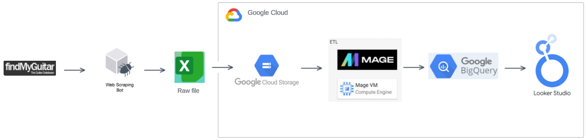
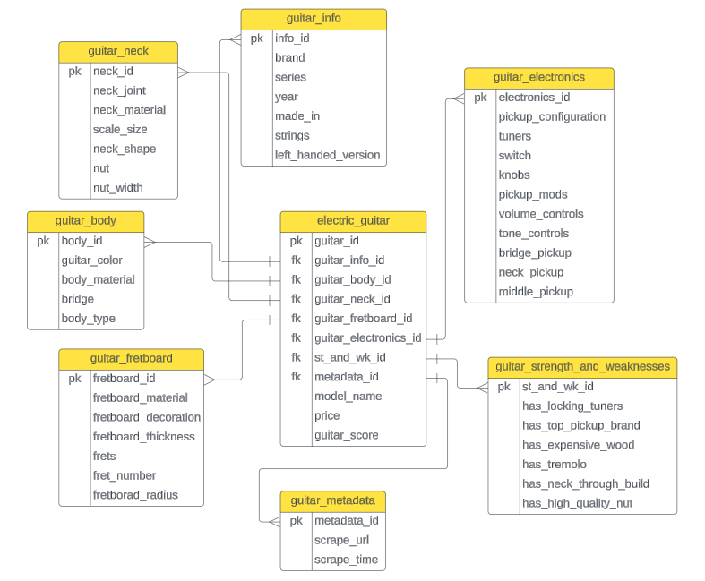

# Electric Guitars Data Engineering Project in Google Cloud Platform

## Description
The goal of the project is to build an end-to-end data engineering project using modern tools. 
## System Architecture

## Technology
* Web Scraping:
  * Data is scraped from this [website](https://findmyguitar.com/) using Selenium library.
* Google Cloud Platform
  * **Google storage:** Raw csv file is stored.
  * **Compute engine:** ETL pipeline is runned on compute engine.
  * **BigQuery:** Structured data is stored in BigQuery database. 
  * **Looker Studio:** Looker studio is connected to the BigQuery database, and simple dashboard is designed.
* Mage
  * Mage is an open source data pipeline tool. It is initialized in GCP compute instance to run the ETL pipeline.

## Data Model

